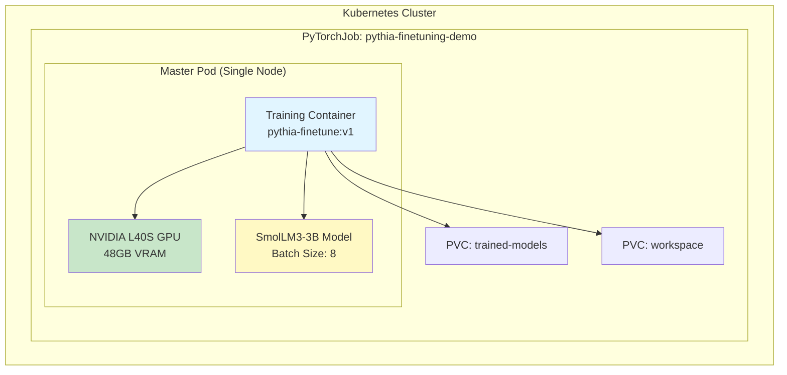
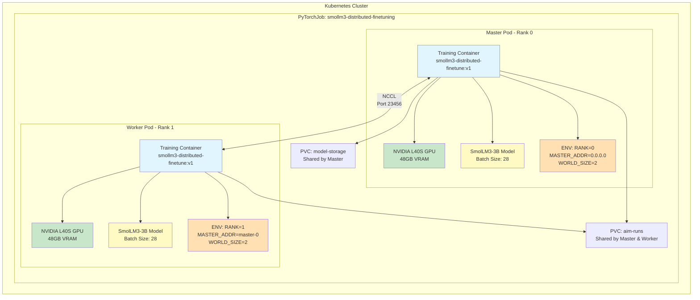
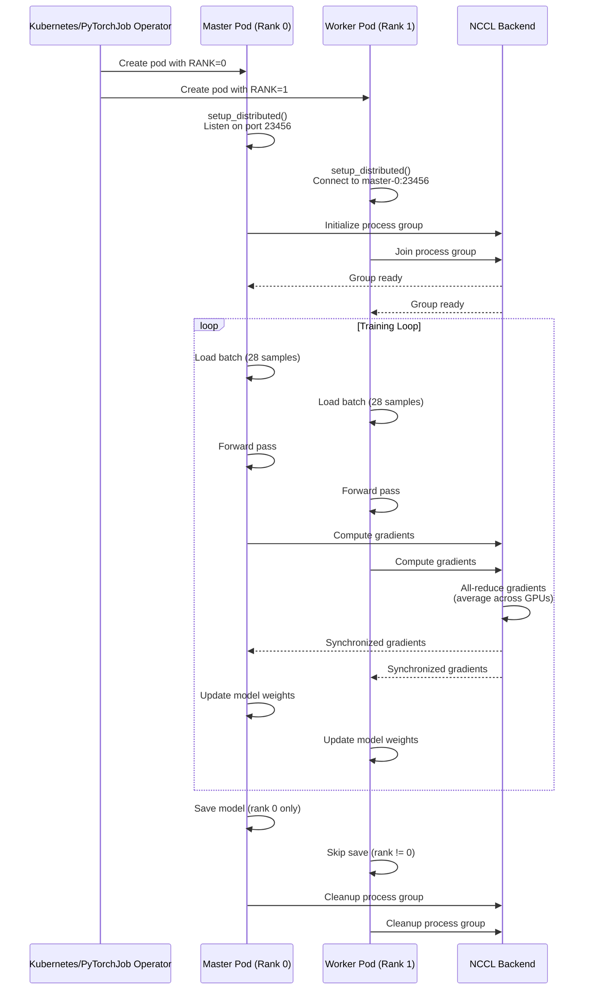
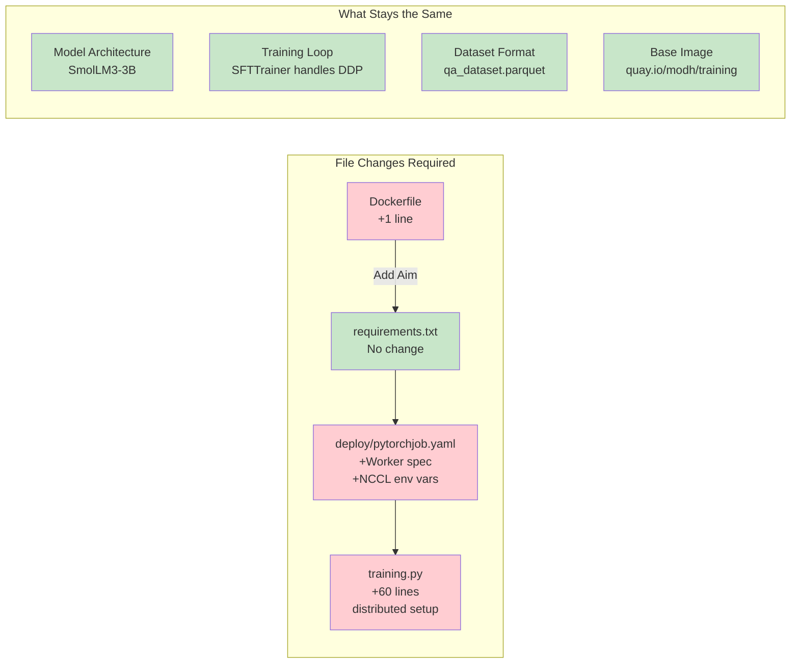
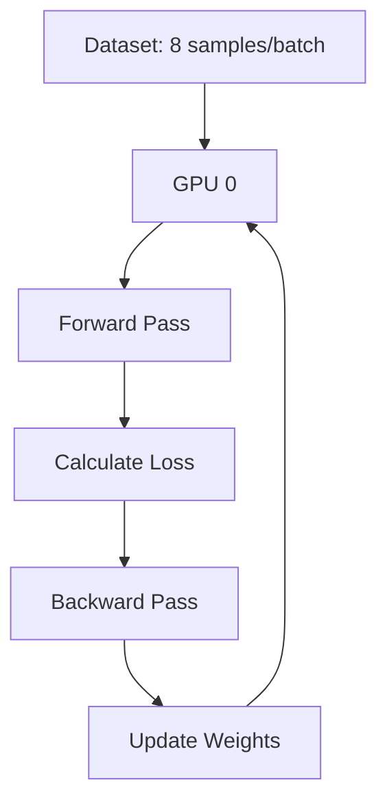
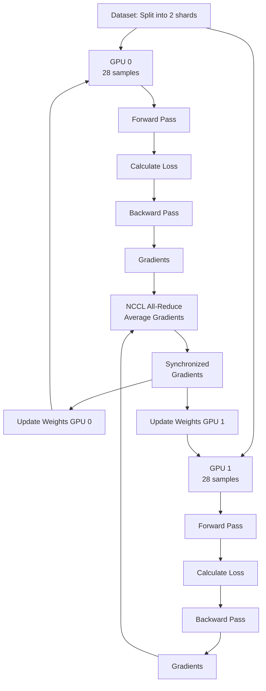
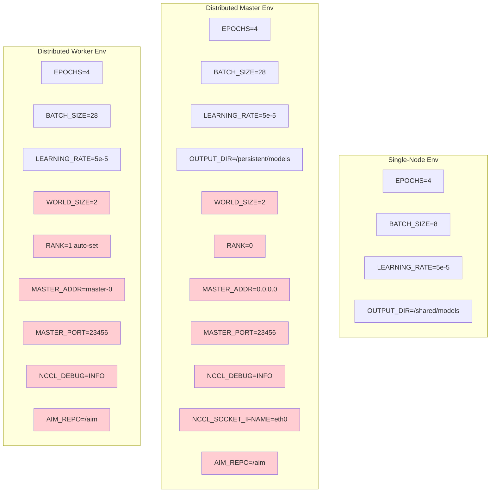
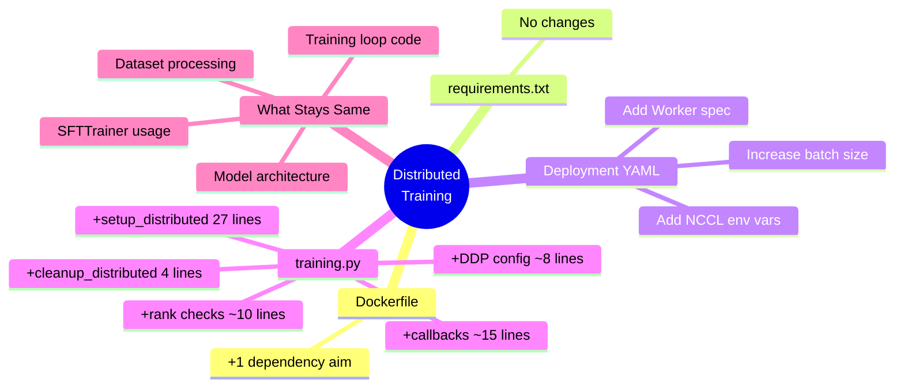

# Architecture Diagrams: Single-Node vs Distributed Training

## Single-Node Training Architecture

**Characteristics:**
- Single pod with 1 GPU
- Batch size: 8 (memory constrained to single GPU)
- No inter-process communication needed
- Simple deployment

---

## Distributed Training Architecture

**Characteristics:**
- 2 pods, each with 1 GPU (2 GPUs total)
- Batch size: 28 per GPU (3.5x larger effective batch)
- NCCL communication over network
- Master coordinates, both train
- Shared Aim tracking across nodes

---

## Training Coordination Flow

---

## Component Changes Overview

**Legend:**
- 🔴 Red: Files that need changes
- 🟢 Green: No changes required

---

## Data Flow: Single-Node vs Distributed

### Single-Node Data Flow

**Effective batch size: 8**

### Distributed Data Flow

**Effective batch size: 56 (28 × 2)**

---

## Environment Variables Comparison

**Red highlighted**: New variables required for distributed training

---

## Key Takeaway: Minimal Changes

**Total code changes: ~60 lines to unlock distributed training across multiple GPUs!**
